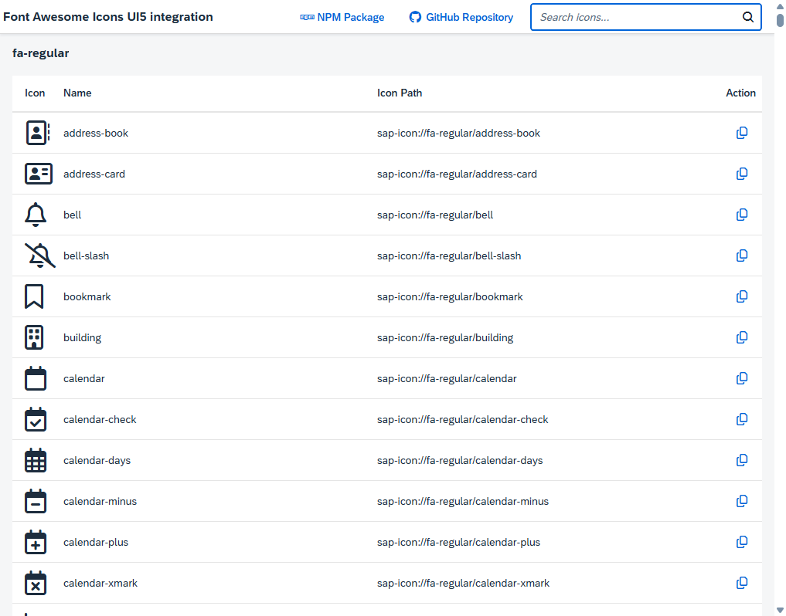

# 🎨 UI5 FontAwesome Icons Library

> **Enhance your SAP UI5/OpenUI5 applications with modern Font Awesome icons!** 🚀

This library seamlessly integrates [Font Awesome](https://fontawesome.com/icons) icons into the SAP UI5 icon system, providing access to thousands of beautiful, scalable icons for your Fiori applications.

[](https://www.npmjs.com/package/ui5-fontawesome-lib)
[](LICENSE)
[](https://sapui5.hana.ondemand.com/)

## 📦 Installation

### NPM Package (Recommended)

```bash
npm install ui5-fontawesome-lib
```

### Manual Installation

Clone this repository and add it as a dependency to your local UI5 project setup.

## 🎯 Features

- ✨ **Seamless Integration**: Use Font Awesome icons with standard UI5 Icon controls
- 🎨 **3 Icon Styles**: Regular, Solid, and Brand icons

## 📋 Icon Mapping

| Font Awesome Style | UI5 Namespace           | Example Usage                                           |
| ------------------ | ----------------------- | ------------------------------------------------------- |
| `fa-regular`       | `sap-icon://fa-regular` | `<Icon src="sap-icon://fa-regular/face-grin-hearts" />` |
| `fa-solid`         | `sap-icon://fa-solid`   | `<Icon src="sap-icon://fa-solid/face-grin-hearts" />`   |
| `fa-brands`        | `sap-icon://fa-brands`  | `<Icon src="sap-icon://fa-brands/github" />`            |

> 💡 **Pro Tip**: The library version corresponds to the Font Awesome version used, ensuring compatibility and access to the latest icons.

## 🛠️ Setup & Configuration

### 1. Install Dependencies

```bash
npm install ui5-fontawesome-lib ui5-middleware-servestatic
```

### 2. Configure UI5 Middleware

Add the following configuration to your `ui5.yaml`:

```yaml
server:
  customMiddleware:
    - name: ui5-middleware-servestatic
      afterMiddleware: compression
      mountPath: /resources/fontawesome/icons/lib/
      configuration:
        npmPackagePath: 'ui5-fontawesome-lib/dist/resources/fontawesome/icons/lib'
```

### 3. Update Manifest

Add the library dependency to your `manifest.json`:

```json
{
  "dependencies": {
    "minUI5Version": "1.108.44",
    "libs": {
      "sap.ui.core": {},
      "sap.m": {},
      "fontawesome.icons.lib": {}
    }
  }
}
```

## 💻 Usage Examples

### Basic Icon Usage

```xml
<!-- Regular icons -->
<Icon src="sap-icon://fa-regular/heart" />

<!-- Solid icons -->
<Icon src="sap-icon://fa-solid/star" />

<!-- Brand icons -->
<Icon src="sap-icon://fa-brands/github" />
```

### With Icon Properties

```xml
<Icon 
    src="sap-icon://fa-solid/rocket" 
    size="2rem" 
    color="#0070f3" 
    tooltip="Launch application" />
```

### In JavaScript/TypeScript

```typescript
import Icon from "sap/ui/core/Icon";

const icon = new Icon({
    src: "sap-icon://fa-solid/check-circle",
    size: "1.5rem",
    color: "green"
});
```

## 🎨 Font Awesome Pro Support

Want to use Font Awesome Pro icons? Here's how to extend this library:

### Setup Pro Icons

1. **Follow the official Font Awesome tutorial**: [Font Awesome Pro Setup](https://docs.fontawesome.com/web/setup/packages)

2. **Create `.npmrc` file**:
   ```
   @fortawesome:registry=https://npm.fontawesome.com/
   //npm.fontawesome.com/:_authToken=YOUR_PRO_TOKEN_HERE
   ```

3. **Install Pro package**:
   ```bash
   npm install --save @fortawesome/fontawesome-pro
   ```

4. **Update build process**: Modify `generate.js` to include Pro font files

5. **Register new styles**: Update `library.ts` to register additional icon styles

## 🚀 Development

### Quick Start

```bash
# Clone the repository
git clone https://github.com/mariokernich/ui5-fontawesome-lib.git
cd ui5-fontawesome-lib

# Install dependencies
npm install

# Start development server
npm start
```

Visit [http://localhost:8080/](http://localhost:8080/) to see the icon browser with search functionality.

## 📸 Screenshot



*Interactive icon browser with search functionality - run `npm start` to see it in action!*

### Available Scripts

| Command                | Description                                 |
| ---------------------- | ------------------------------------------- |
| `npm start`            | 🏃‍♂️ Start development server with live reload |
| `npm run build`        | 🔨 Build the library for production          |
| `npm run test`         | 🧪 Run tests and linting                     |
| `npm run ts-typecheck` | 🔍 TypeScript type checking                  |
| `npm run lint`         | ✨ ESLint code quality check                 |

### Debugging

Enable sourcemaps in your browser's developer console to debug the original TypeScript code. Use `Ctrl`/`Cmd` + `P` in Chrome to open specific `.ts` files.

## 📊 Project Structure

```
ui5-fontawesome-lib/
├── src/                    # Source files
│   ├── fonts/             # Font Awesome font files
│   ├── library.ts         # Main library file
│   └── themes/            # UI5 themes
├── test/                  # Test files
├── dist/                  # Build output
└── scripts/               # Build and deployment scripts
```

## 🤝 Contributing

We welcome contributions! Please feel free to submit issues and pull requests.

### Development Workflow

1. Fork the repository
2. Create a feature branch (`git checkout -b feature/amazing-feature`)
3. Commit your changes (`git commit -m 'Add amazing feature'`)
4. Push to the branch (`git push origin feature/amazing-feature`)
5. Open a Pull Request

## 📄 License

This project is licensed under the Apache Software License, version 2.0 - see the [LICENSE](LICENSE) file for details.

## 🔗 Links

- 📦 [NPM Package](https://www.npmjs.com/package/ui5-fontawesome-lib)
- 🐙 [GitHub Repository](https://github.com/mariokernich/ui5-fontawesome-lib)
- 📚 [Font Awesome Documentation](https://fontawesome.com/docs)
- 🎯 [SAP UI5 Documentation](https://sapui5.hana.ondemand.com/)

## ⭐ Support

If you find this library helpful, please consider giving it a star on GitHub! ⭐

---

**Made with ❤️ for the SAP UI5 community**
