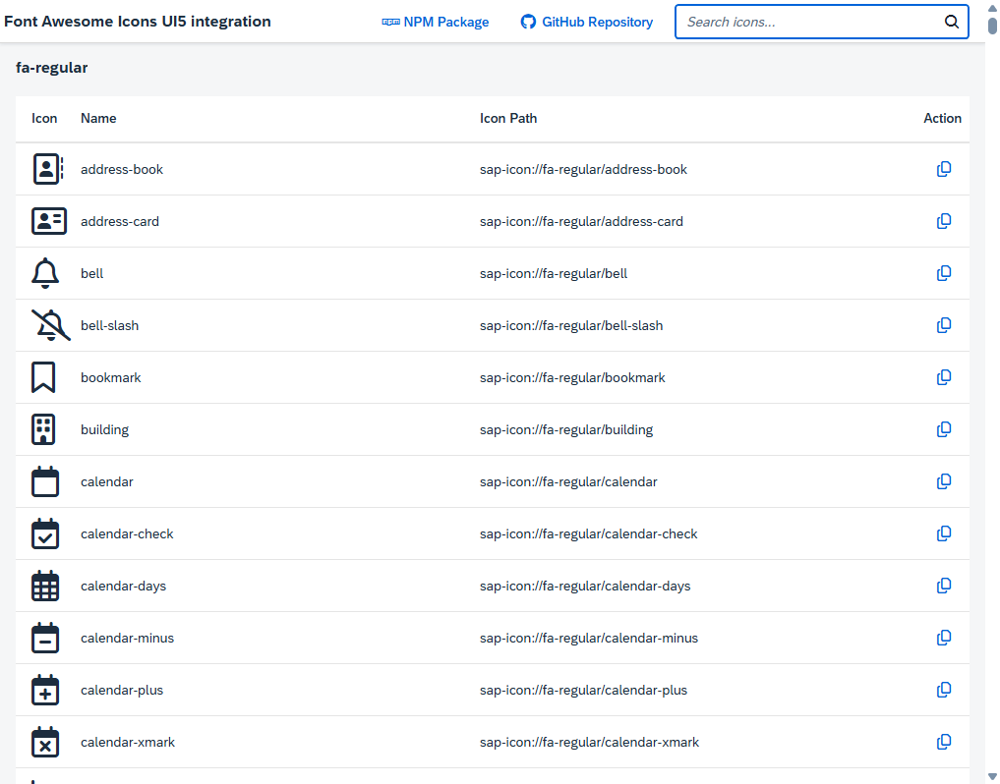

# UI5 Library fontawesome.icons.lib

This library uses the free version of [Font Awesome](https://fontawesome.com/icons) to extend the UI5 icon library.

## Installation

### NPM Package

Install the library from npm:

```sh
npm install ui5-fontawesome-lib
```

### Manual Installation

You can also add it as a dependency to your UI5 project manually.

## Description

| Font Awesome | UI5 Namespace         | Example                                                  |
| ------------ | --------------------- | -------------------------------------------------------- |
| fa-regular   | sap-icon://fa-regular | &lt;Icon src="sap-icon://fa-regular/face-grin-hearts" /> |
| fa-solid     | sap-icon://fa-solid   | &lt;Icon src="sap-icon://fa-solid/face-grin-hearts" />   |
| fa-brands    | sap-icon://fa-brands  | &lt;Icon src="sap-icon://fa-brands/github" />            |

The version of this library corresponds to the Font Awesome version used.

To use this library, add it as a dependency to your UI5 project.

Clone the repository and run `npm run start` to view a complete list of all available icons.



## Usage in UI5 Projects

After installation, you need to configure the UI5 middleware to serve the library resources. Add the following configuration to your `ui5.yaml`:

```yaml
server:
  customMiddleware:
    - name: ui5-middleware-servestatic
      afterMiddleware: compression
      mountPath: /resources/fontawesome/icons/lib/
      configuration:
        npmPackagePath: 'ui5-fontawesome-lib/dist/resources/fontawesome/icons/lib'
```

Additionally, you need to add the library dependency to your `manifest.json`:

```json
{
  "dependencies": {
    "minUI5Version": "1.108.44",
    "libs": {
      "sap.ui.core": {},
      "sap.m": {},
      "fontawesome.icons.lib": {}
    }
  }
}
```

Then you can use the Font Awesome icons in your UI5 applications:

```xml
<Icon src="sap-icon://fa-solid/heart" />
<Icon src="sap-icon://fa-regular/star" />
<Icon src="sap-icon://fa-brands/github" />
```

## Font Awesome Pro

You can fork this library as a private repository and add your Font Awesome Pro icons.

### Steps to Add Font Awesome Pro Icons

1. Follow the official Font Awesome tutorial: [Font Awesome Pro Setup](https://docs.fontawesome.com/web/setup/packages).
2. Create a `.npmrc` file with the following content:
   ```
   @fortawesome:registry=https://npm.fontawesome.com/
   //npm.fontawesome.com/:_authToken=XXXXXXXX-XXXX-XXXX-XXXX-XXXXXXXXXXXX
   ```
3. Install the Pro files using npm:
   ```sh
   npm install --save @fortawesome/fontawesome-pro
   ```
4. Adjust the `generate.js` script to include the Pro font files in the build process.
5. Update the `library.ts` file to register the new styles.

## Requirements

You need either [npm](https://www.npmjs.com/) or [yarn](https://yarnpkg.com/) for dependency management.

## Preparation

Install the dependencies using npm or yarn:

```sh
npm install
```

(For yarn, use `yarn` instead.)

## Run the Library

Run the library locally in watch mode for development:

```sh
npm start
```

After running this command, the app will be available at [http://localhost:8080/](http://localhost:8080/). A browser window should automatically open, pointing to your controls' test page.

(For yarn, use `yarn start` instead.)

## Debug the Library

You can debug the original TypeScript code in the browser using sourcemaps. Ensure sourcemaps are enabled in the browser's developer console. If the browser doesn't automatically jump to the TypeScript code, use shortcuts like `Ctrl`/`Cmd` + `P` in Chrome to open the desired `*.ts` file.

## Build the Library

### Unoptimized Build (Quick)

Build the project to generate an app ready for deployment:

```sh
npm run build
```

The output will be placed in the `dist` folder. To start the generated package, run:

```sh
npm run start:dist
```

Note: The HTML page still loads the UI5 framework from the relative URL `resources/...`, which is dynamically provided by the UI5 tooling. For deployment, update this URL to either [the CDN](https://sdk.openui5.org/#/topic/2d3eb2f322ea4a82983c1c62a33ec4ae) or your local UI5 deployment.

(For yarn, use `yarn build` and `yarn start:dist` instead.)

## Check the Code

Run a TypeScript type check:

```sh
npm run ts-typecheck
```

This checks the library's code for type errors and syntax issues.

To lint the TypeScript code, run:

```sh
npm run lint
```

(For yarn, use `yarn ts-typecheck` and `yarn lint` instead.)

## License

This project is licensed under the Apache Software License, version 2.0, except as noted otherwise in the [LICENSE](LICENSE) file.
